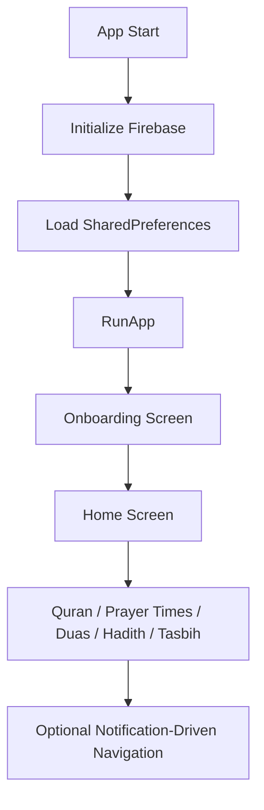

# 🚀 Quran App

A modern Islamic Flutter application for Quran reading, prayer times, adhkar/duas, hadith, and daily worship tools.

## 📱 Screenshots

Use clean and aligned screenshots.

| Home | Quran | Adhkar | Hadith |
|------|-------|--------|--------|
|  |  |  |  |

## 🌟 Features

- 🔹 **Quran Reading** - Browse surahs and read verses with an Arabic-first experience.
- 🔹 **Prayer Times** - Fetch and display prayer times with caching and performance provider support.
- 🔹 **Duas & Adhkar** - Dedicated sections for daily azkar and supplications.
- 🔹 **Hadith Section** - Read hadith collections from local assets.
- 🔹 **Tasbih Counter** - Digital tasbih with simple interaction flow.
- 🔹 **Khatma Tracking** - Track recitation progress and reminders.
- 🔹 **Notifications** - Local notifications + Firebase Messaging integration.
- 🔹 **Dark/Light Theme** - Theme switching with persisted settings.

## 🛠️ Technologies & Packages

### 🔧 Core Technologies

- Flutter
- Dart
- Firebase (Core + Messaging)
- Material 3

### 📦 Key Packages

- State Management: Provider
- Networking: http
- Routing: go_router
- Serialization: json_annotation + json_serializable
- Local Storage: shared_preferences
- Notifications: flutter_local_notifications + workmanager + timezone
- Utilities: connectivity_plus + logger + share_plus + url_launcher + google_fonts

## 🏗️ Architecture

The project follows a scalable and maintainable architecture:

```text
lib/
├── core/
│   ├── api/               # Shared API helpers and network utilities
│   ├── constants/         # App-wide constants
│   ├── errors/            # Error models and handlers
│   ├── navigation/        # Router and notification routing
│   ├── providers/         # Global providers (settings, notifications)
│   ├── services/          # Notification, FCM, background services
│   ├── theme/             # Colors, typography, themes
│   ├── utils/             # Shared utility functions
│   └── widgets/           # Reusable widgets
│
└── features/
      ├── onboarding/
      │   ├── data/
      │   ├── domain/
      │   └── presentation/
      ├── quran/
      │   ├── data/
      │   ├── domain/
      │   └── presentation/
      ├── prayers/
      │   ├── data/
      │   ├── domain/
      │   └── presentation/
      ├── duas/
      ├── hadeath/
      ├── khatma/
      └── settings/
```

## 🔄 App Flow



## 🎨 UI/UX Design

### 🎨 Color Palette

- Primary: `#795547`
- Secondary: `#F0E6D2`
- Background: `#FEFBF4`
- Surface: `#FFFBF9`
- Error: `#E57373`

### ✍️ Typography

- Headline: Cairo
- Title: Cairo
- Body: Cairo
- Caption: Cairo

### 🧭 Navigation

- GoRouter-based named routes
- Home hub with feature navigation cards
- Notification routing support for deep links

## 🚀 Getting Started

### 📌 Prerequisites

- Flutter SDK `^3.8.0`
- Dart SDK (compatible with Flutter SDK)
- Android Studio or VS Code

### ⚙️ Installation

```bash
git clone https://github.com/Khaled-shahien/quran_app.git
cd quran_app
flutter pub get
copy .env.example .env
flutter run --dart-define-from-file=.env
```

The API values are optional for features that do not call their corresponding
services. Keep `.env` local and never commit real credentials.

## 📁 Project Structure

### 🔹 Core Layer

Contains shared logic:

- Utilities
- Constants
- Themes
- Shared widgets
- Services (notifications, background tasks, FCM)

### 🔹 Feature Layer

Each feature is isolated and modular:

- Data Layer -> API calls, local data sources, repositories
- Domain Layer -> Entities, repository contracts, business logic
- Presentation Layer -> Screens, providers, widgets

## 🔐 Backend / API / Firebase Integration

- 🔑 Authentication -> Not enabled yet (Firebase project is configured for messaging/core usage)
- ☁️ Database -> Local assets + SharedPreferences cache (Firestore not used currently)
- 🌐 APIs -> Prayer times and Quran metadata integrations via http services
- 🔔 Messaging -> Firebase Cloud Messaging + local notification scheduling

## 📱 Responsive Design

The app supports multiple platforms:

- ✅ Mobile
- ✅ Tablet (layout-adaptive widgets)
- ✅ Web (Flutter web target available)
- ✅ Desktop (Windows, macOS, Linux folders included)

## 🧪 Testing

Run tests using:

```bash
flutter test
```

Verify formatting and run static analysis:

```bash
dart format --output=none --set-exit-if-changed lib test integration_test
flutter analyze
```

### Test Types

- Unit Tests
- Widget Tests
- Integration Tests (planned expansion)

## 🤝 Contributing

To contribute:

1. Fork the repository.
2. Create a new branch.
3. Make your changes.
4. Commit your work.
5. Push to GitHub.
6. Open a Pull Request.

## 📄 License

This project is licensed under the MIT License.

## 🙏 Acknowledgements

- Flutter
- Dart
- Material Design
- Firebase
- All external packages used in pubspec

## 📞 Support (Optional)

- GitHub Issues
- Discussions
- Wiki

## 📚 Predefined Project Profile (For AI Usage)

### 🕌 Islamic App

- Features:
   - Quran
   - Hadith
   - Prayer Times
   - Tasbih Counter
   - Dark/Light Mode
   - Localization-ready (AR/EN)
- Technologies:
   - Flutter
   - Provider
   - http
   - google_fonts
   - Firebase Messaging
- Architecture:
   - Feature-first + Clean Architecture
