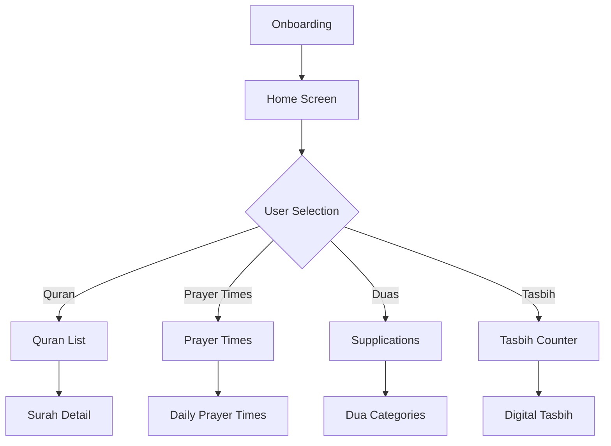

# 🕌 Quran App - Islamic Digital Companion

<p align="center">
  
</p>

<p align="center">
  <em>A beautifully crafted Islamic application featuring Quran text, prayer times, authentic duas, tasbih counter, 99 Names of Allah, and more — fully RTL-optimized with premium Islamic-themed UI.</em>
</p>

<div align="center">

[](https://opensource.org/licenses/MIT)
[](https://flutter.dev)
[](https://flutter.dev)

</div>

## 📱 Screenshots

<div align="center">

| Home Screen | Quran View | Prayer Times | Tasbih Counter |
|-------------|------------|--------------|----------------|
|  |  |  |  |

</div>

## 🌟 Features

- 🕌 **Complete Quran**: Access all 114 Surahs with Arabic text and translations
- 🕋 **Prayer Times**: Accurate location-based prayer times using AlAdhan API
- 🤲 **Authentic Duas**: Collection of verified Islamic supplications
- 📿 **Digital Tasbih**: Electronic counter for dhikr and tasbih
- ⭐ **99 Names of Allah**: Beautiful presentation of Asma ul Husna
- 📖 **Islamic Reminders**: Daily verses and spiritual reminders
- 🌙 **Dark Mode**: Eye-friendly dark theme for night reading
- 🌐 **RTL Support**: Full Arabic language and right-to-left layout
- 🎨 **Premium UI**: Material 3 design with Islamic aesthetics

## 🛠️ Technologies & Packages

- **Flutter SDK** - Cross-platform mobile framework
- **Provider** - State management solution
- **HTTP** - API communication
- **Shared Preferences** - Local data persistence
- **Google Fonts** - Arabic and international typography
- **Connectivity Plus** - Network status monitoring
- **Logger** - Application logging
- **Clean Architecture** - Separation of concerns

## 🏗️ Architecture

```
lib/
├── core/                         # Shared cross-cutting concerns
│   ├── api/                      # API clients & services
│   ├── constants/                # App-wide constants
│   ├── errors/                   # Exception handling
│   ├── services/                 # Shared services
│   ├── theme/                    # Material 3 theming
│   └── widgets/                  # Reusable UI components
├── features/                     # Feature modules
│   ├── duas/                     # Supplications feature
│   ├── onboarding/               # Welcome & navigation
│   ├── prayers/                  # Prayer times feature
│   │   ├── data/                 # API & models
│   │   ├── domain/               # Business logic
│   │   └── presentation/         # UI & state management
│   └── quran/                    # Quran feature
│       ├── data/                 # Quran API & models
│       ├── domain/               # Surah entities
│       └── presentation/         # Quran screens
└── main.dart                     # App bootstrap & routing
```

## 🔄 App Flow



## 🎨 UI/UX Design

### Color Palette
- **Primary Green**: `#2E7D32` (Islamic green)
- **Secondary Beige**: `#EFEAE0` (Parchment paper)
- **Accent Gold**: `#FFB300` (Golden accents)
- **Dark Primary**: `#1B5E20` (Deeper green)
- **Text Colors**: `#2C3E50`, `#FFFFFF`

### Typography
- **Arabic Font**: Amiri (Classic Arabic typography)
- **Latin Font**: Cairo (Modern Arabic-inspired Latin)
- **Headings**: Bold, readable sizes
- **Body Text**: Comfortable reading experience

## 🚀 Getting Started

### Prerequisites
- Flutter SDK 3.11.0 or higher
- Dart 3.0 or higher
- Android Studio / VS Code
- Git

### Installation

1. Clone the repository:
```bash
git clone https://github.com/yourusername/quran-app.git
cd quran-app
```

2. Install dependencies:
```bash
flutter pub get
```

3. Run the application:
```bash
flutter run
```

### Build for Production
```bash
flutter build apk --release
```

## 📁 Project Structure

The app follows Clean Architecture with feature-first organization:

### Core Layer
- **API**: Base API service, interceptors, error handling
- **Constants**: App-wide constants, strings, configuration
- **Errors**: Custom exception handling
- **Services**: Shared utilities (network, storage)
- **Theme**: Material 3 theming system
- **Widgets**: Reusable UI components

### Feature Layer
Each feature follows the same structure:
```
feature_name/
├── data/
│   ├── models/           # Data models
│   ├── data_sources/     # API services, local DB
│   └── repositories/     # Repository implementations
├── domain/
│   ├── entities/         # Business objects
│   └── repositories/     # Repository interfaces
└── presentation/
    ├── screens/          # UI screens
    ├── widgets/          # Reusable components
    └── providers/        # State management
```

## 🔐 Backend / API Integration

- **Quran API**: [AlQuran Cloud API](https://alquran.cloud/api) for Quran text
- **Prayer Times API**: [AlAdhan API](https://aladhan.com/prayer-times-api) for accurate prayer times
- **No backend required**: All data sourced from public Islamic APIs
- **Offline Support**: Caching mechanism for improved UX

## 📱 Responsive Design

- **Mobile**: Optimized for phone screens
- **Tablet**: Enhanced layouts for larger screens
- **Web**: Responsive design for desktop browsers
- **RTL**: Full right-to-left language support
- **Accessibility**: Proper contrast ratios and text scaling

## 🧪 Testing

```bash
# Run unit tests
flutter test

# Run widget tests
flutter test --coverage

# Analyze code quality
flutter analyze

# Format code
flutter format .
```

## 🤝 Contributing

We welcome contributions! Here's how you can help:

1. Fork the repository
2. Create a feature branch (`git checkout -b feature/amazing-feature`)
3. Commit your changes (`git commit -m 'Add amazing feature'`)
4. Push to the branch (`git push origin feature/amazing-feature`)
5. Open a Pull Request

### Code Standards
- Follow [Effective Dart](https://dart.dev/guides/language/effective-dart) guidelines
- Maintain Clean Architecture principles
- Write tests for new features
- Document public APIs
- Follow Material Design 3 guidelines

## 📄 License

This project is licensed under the MIT License - see the [LICENSE](LICENSE) file for details.

## 🙏 Acknowledgements

- Quran data provided by [AlQuran Cloud](https://alquran.cloud/)
- Prayer times by [AlAdhan API](https://aladhan.com/)
- Islamic content reviewed by scholars
- Arabic fonts from Google Fonts collection
- Icons from Material Design Icons

---

<div align="center">

**🕌 Made with ❤️ for the Muslim Ummah**

*May Allah accept our deeds and guide us to His straight path.*

</div>